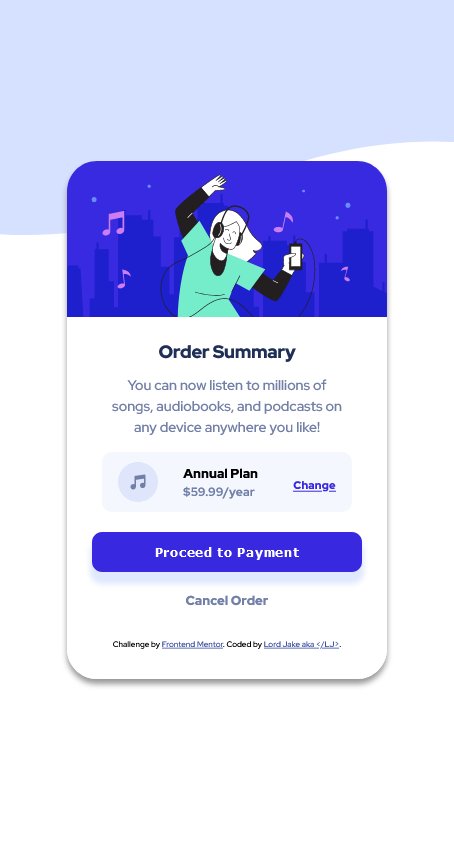

# Frontend Mentor - Order summary card solution

This is a solution to the [Order summary card challenge on Frontend Mentor](https://www.frontendmentor.io/challenges/order-summary-component-QlPmajDUj). Frontend Mentor challenges help you improve your coding skills by building realistic projects.

## Table of contents

- [Overview](#overview)
  - [The challenge](#the-challenge)
  - [Screenshot](#screenshot)
  - [Links](#links)
- [My process](#my-process)
  - [Built with](#built-with)
  - [What I learned](#what-i-learned)
  - [Continued development](#continued-development)
  - [Useful resources](#useful-resources)
- [Author](#author)
- [Acknowledgments](#acknowledgments)

**Note: Delete this note and update the table of contents based on what sections you keep.**

## Overview

### The challenge

Users should be able to:

- See hover states for interactive elements

### Screenshot

)

### Links

- Solution URL: [Add solution URL here](https://github.com/paul8989/fendmentor-order-summary-card-challenge)
- Live Site URL: [Add live site URL here](https://order-summary-challenge-lj.netlify.app)

## My process

### Built with

- Semantic HTML5 markup
- CSS custom properties
- Flexbox
- Mobile-first workflow

### What I learned

Learned laying out in flexbox , which is far better tha using floats in old days.

```css
.container-plan {
  align-items: center;
  align-self: center;
  background-color: var(--color-very-pale-blue);
  border-radius: 10px;
  display: flex;
  justify-content: center;
  margin-bottom: 20px;
  padding: 0 50px;
  width: 250px;
}
```

### Continued development

I would like to use flex and grid to laying out more components in future.
I felt the align keywords for flex and gris are pretty confusing and may need to get a hang of them.

### Useful resources

- [Example resource 1](https://stackoverflow.com/questions/9862167/positioning-div-element-at-center-of-screen) - This article helped me in identifying solution for making the card in centre irrespective of all screen sizes.

## Author

- [Lord Jake]
- Frontend Mentor - [@yourusername](https://www.frontendmentor.io/profile/paul8989)
